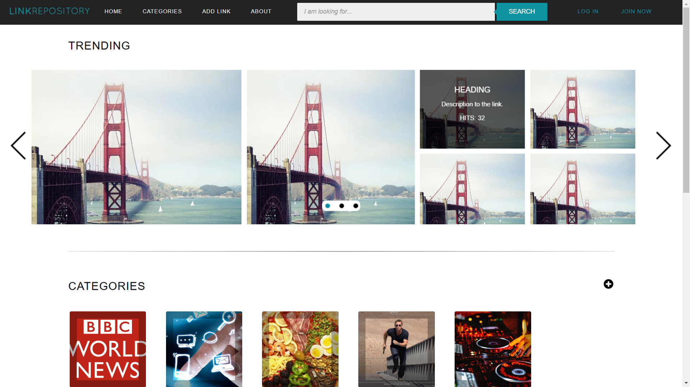
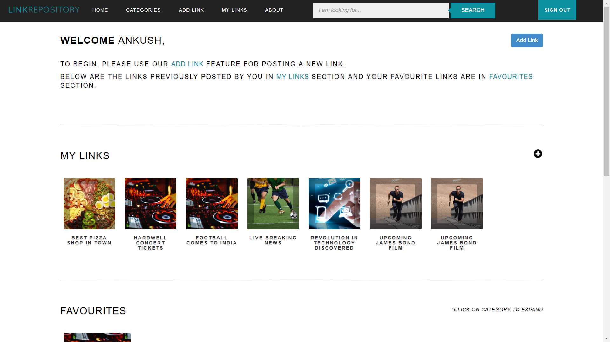
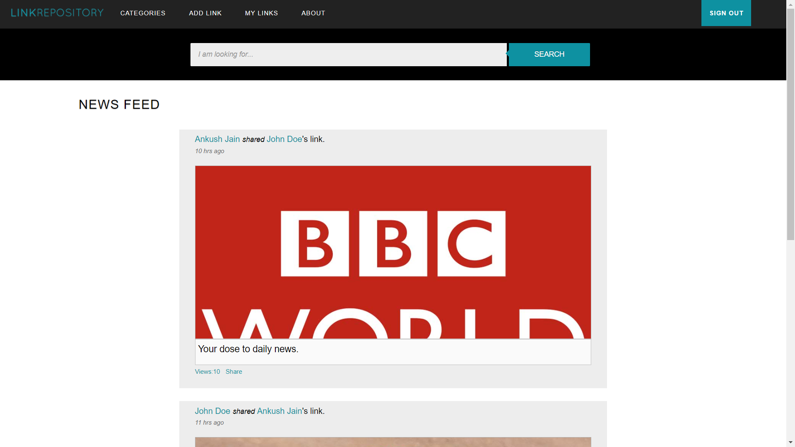
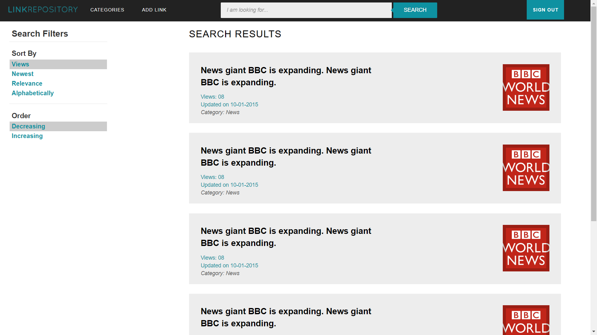
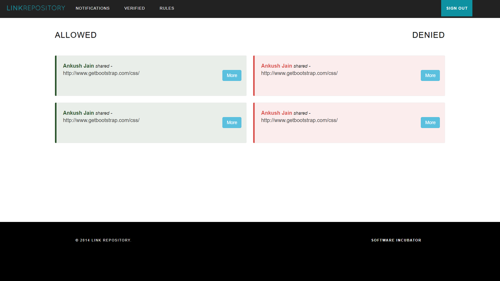

# Link Repository Application
An application that can store bookmarks, share them on social media platforms and gather a brief description of the webpage by web crawling. Developed using Laravel web application framework for PHP and Bootstrap 3.2.0.

This application was developed during the Winter 2014 as an extracurricular project. Since then, the application has not been maintained and some functionalities (like social media sign-in and link crawling) might not work properly.

## Table of Content
- [Frameworks and Languages](#frameworks-and-languages)
- [Tasks Performed](#tasks-performed)
- [Screenshots](#screenshots)

## Frameworks and Languages
Following is the list of technologies that I coded with in this project. For the comprehensive list, <a href="readme/dependencies.md">click here</a>.

### Languages
- HTML5
- CSS3
- JavaScript

### Frameworks
- Bootstrap 3.2.0

### Libraries
- JQuery 1.11.1

### Database
- MySQL 5.5.24+

## Tasks Performed
- Designed the complete UI of the application from scratch, with Bootstrap 3 and JQuery plug-ins.
- Integrated the UI design to the Laravel blade views.
- Coded the MySQL queries for the application.
- Debugged the minor PHP errors in controller-view integration.

## Screenshots

> **Note**: Following screenshots are from the static design templates.

|

 1. Landing Page|
|:-------------------------:|

| 2. Home Page after Login| 3. News Feed|
|:-------------------------:|:-------------------------:|
| **4. Search Results**| **5. Link Moderation Page**|
